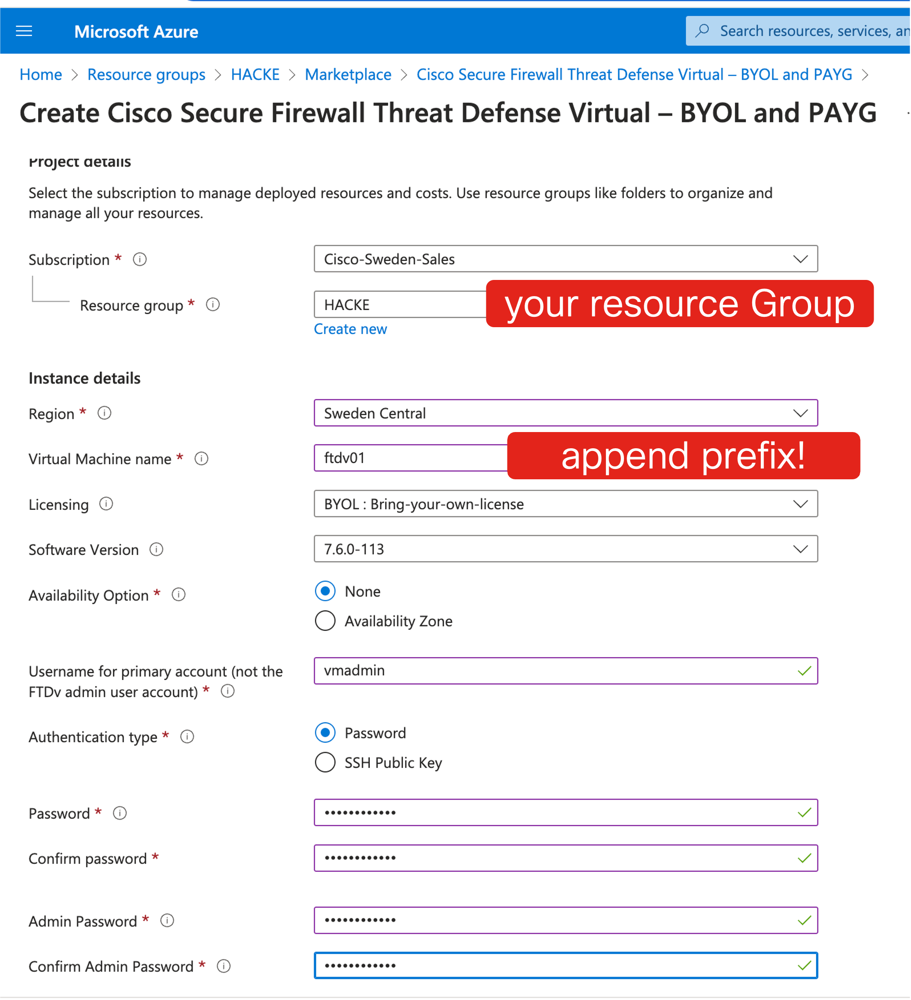

# Inserting Cisco Secure Firewall FTD in Azure with GWLB

## Introduction

This lab shows how to use service chaining with an Azure Gateway Load balancer in Azure to protect a web site.

You will need access to an azure subscription and the rights to create necessary objects in a resource group.

Prerequisite knowledge includes
* some understanding of Azure Networking (VNETs, subnets, routing, load balancers, NSGs...)
* some understanding of VXLAN
* some understanding of Cisco Secure Firewall (FTD) managed  by Cisco Firepower Management Center (FMC)
* some understanding of Azure CLI

The topology is shown in figure below.

All resources shown in azure should be  created in the student's Azure resource group. At a high level we note that we have two different VNETs.
* SERVERVNET where we define the public load balancer that distributes the traffic between Azure VMs VM1 and VM2 in the default subnet. We also have a public IP associated with the public load balancer so we can test the connection.
* FWVNET where we will define the Gateway Load Balancer (GWLB) that will load balance traffic over the firewalls that will add services such as access rules with IPS, Anti-Malware, Reputation filtering and more.

The student accesses all the lab with an internet routable internet (student public IP).

## Initial Setup using Cloudshell with bash script

Take note of the Azure Resource Group that is allocated by the lab proctor, the resource group must be unique in the lab environment subscription.

Find out the public IPv4 address that you use when connecting to the internet, for example using a site such as [What is My IP](https://www.whatismyip.com/).

1. **Login to the Azure Portal.**
2. **Open a Cloudshell with Bash.**

   
   
4. **In cloudshell, use wget to retrieve the setupscript.**

   wget raw.githubusercontent.com/drnop/az700training/refs/heads/main/azure-ngfw-gwlb-prep.sh
   

6. **In cloudshell execute the script file**

   bash azure-ngfw-gwlb-prep.sh
   
   This should prompt you for your unique Azure Resource Group, your public IP address and the passwords used to create the VMs.

   (The passwords for the VMs are required at creation, but typically you would not need to use the passwords to login to the VMs).

8. **The setup will take a couple of minutes. Rest!**

9. **When the setup script has completed, inspect the resources created in the Azure Portal.**

Note: Your resources should have been prefixed with your group name, e.g. P0VM1.

VNET SERVERNET with a default subnet has been created
Public Load Balancer PLB has been created
VM1 and VM2 have been created.
A public IP named PublicIP has been created, what is the value of the IP address?

10. **Test that you can access the public IP with your browser using http**

Note: HTTPS has not been setup on the server, so ensure you use HTTP.

Note: Access to the server has been restricted by an NSG to only allow your public IP entered in the setup script.

We now have create a fantastic web application which is load balanced with a public load balancer. Our mission now is to insert Cisco Secure Firewall to secure this environment. We will do so without changing the topology in this VNET and in a way which supports autoscaling.

## Adding Cisco Secure Firewall: FMC

We will now add Cisco Secure Firewalls. This is done in a separate VNET, FWVNET, that could potentially be in a different region or even subscription. The FWVNET has already been created by the script as shown in picture below. You may want to make a note of the IP prefixes of the ManagementSubnet and outside subnets.

The topology of FWVNET is shown in picture below. We have a Gateway Load Balancer - more about that later- and also subnets ManagementSubnet and outside. We will add FMC to the ManagementSubnet. The FTDs will have one interface in the ManagementSubnet (for management by FMC) and the data interface GigabitEthernet0/0 will be in the outside subnet. The script has also created an inside subnet but that will not be needed because the design is based on VXLAN, allowing all traffic to enter via the outside interface.

1. **Find Cisco Firepower Management Center 300 in the Marketplace and click create**

2. **FMC Resource Group, Region and Credentials**

Important: Use your Resource Group and Region where you created your previous resources.
Important: Prefix the name of the FMC with your group name, e.g. "XXfmc".

Note that you have two sets of admin credentials, one for accessing the FMC VM and one for accessing the FMC web GUI. 
For NTP you can give pool.ntp.org or any valid public NTP server.

Important: You will need the FMC web GUI credentials later!

Click Next to enter networking details.

4. **FMC VNET and subnet**

Important: Use the FWVNET and the ManagementSubnet.

5. **Create the FMC**

This will take some time. A good time for coffee or a smoke. Or for learning how to smoke if you don't already.

6a. **Modify NSG called xxxNSG to allow inbound access on port 80 from your public IP**

This step is necessary if PODs have been pre-prepared by lab proctor who did not know your public IP beforehand.

6b. **Modify NSG called xxScRIPTERnsg to allow incound access on port 22 from your Public IP**

This step is necessary if PODs have been pre-prepared by lab proctor who did not know your public IP beforehand.

6c. **Modify NSG attached to FMC interface to allow inbound access from your public IP**

By default access access to FMC is closed. In Azure portal, find the NSG and modify the incoming rules so you can access the FMC via HTTPS form your PC.

7. **Access the FMC via the Web GUI and turn on evaluation license**

Find the FMC public IP and point your web browser to it with https://. Turn on evaluation licensing.

9. **Add a user to FMC to allow for API access**

We will use REST APIs to configure FMC.

Add an API user by navigating to users menu. Ensure you note down the username and pasword and give the user the Administrator Role.

10. **Access the Scripting host**

There are many options for automating the inital FMC configuraiton (terraform etc). We will however use python, for purely nostalgic reasons.
The scripting host could be any system with python3 installed. If your PC fulfills the requirements you can use it. 

Otherwise there is a SCRIPTER (Ubuntu machine with python installed) in FWVNET which you can reach via its public IP and username: vmadmin / password. (The password is what you spacified in the initial bash setup script(.

Note: It is possible to access FMC directly and make the configuration changes specified below in the Web GUI if you prefer. 

11. **Prepare the creds.json file**

    The script reads a file creds.json which constains information to access the FMC via the API.
    Create a file with the following format called creds.json, but modify the IP of the FMC and the credentials to suit your environment.

    {"ip":"FMC ip address",
    "username":"apiuser",
    "password":"xxxxxxxx"}

12. **Download cats.py setupfmc.py to the Scripting host**

   curl -O https://raw.githubusercontent.com/drnop/az700training/refs/heads/main/cats.py
   (cats.py is a demo python library that can be used to access some Cisco Security Solutions.)

   curl -O https://raw.githubusercontent.com/drnop/az700training/refs/heads/main/setupfmc.py
   (setupfmc.py is the script that will setup FMC initial configuration.)

   The current directory on the Scripting Host should now how 3 files
   
   creds.json
   cats.py
   setupfmc.py
   
13. **Run the setupfmc.py script**

   On the scripting host:

   python3 setupfmc.py

   The script with output the configuration changes.

   

15. **Examine FMC the created configurations in FMC**

   The script will create
   
   a device group called AutoScaleDeviceGroup (where we could later add devices that are autoscaled).
   
   security zone OutsideZopne, used for the outside interface
   
   security zone VNIzone, used for VNI interfaces
   
   Access Poliy MyAccessPoliy with an access rule permitting and logging all traffic between VNIzone and VNIzone. This policy is for testing only, once topology is working we could restrict access, add IPS etc.
   
   
   
   Platform Settings Platform Policy that allows HTTP access on port 9443 from IP 168.63.129.16. This is to allow from health probes from Azure that will verify that the FTD is up and running. 
   
   
   
   ## Adding an FTDv from Marketplace to FWVNET 

   Note that all the steps in this section would typically be fully automated and maybe initiated by autoscaling a scaleset. There are Azure Functions and Logic Apps available to achieve this
   as documented in the References.

   Before adding an FTD (manually), lets remember the topology of FWVNET.

   

   We have 3 subnets: ManagementSubnet (172.16.0.0/24), outside (172.16.1.0/24) and inside (127.16.2.0/24). Note that the inside subnets is not really used for traffic in this design, but it is still there in the template.

   1. **Find Cisco Firepower Threat Defense Virtual in the Marketplace and click create**

   
   
   2. **Specify Resource Group, Region and Credentials**

   Ensure you choose the Resource Group and Region used in this lab.

   Important: Prefix the name of the FTD with your group name, e.g: G11ftdv01 if you are G11.
   
   Again we have two separate credentials, VM access and admin access to FTDv CLI.

   
   
   3. **Specify FMC registration parameters**

   The template lets us specify FMC registration parameters (so we don't really need console access to the FTD!)

   You need to check the IP of FMC from Azure Portal - since it is the first created machine on ManagementSubnet it should be 172.16.0.4.

   We will not use a cluster in this lab.

   
    
    
   5. **Specify VNETs and subnets**

   Do not change the size of FTDv to something more expensive and energy-consuming.

   Be careful to specify the correct VNET (FWVNET) and subnets (ManagementSubnet, outside, inside) for respective interface.

   

   Note that we don't really need a public IP for the FTDv since we are using registration via the template, but could be good for troubleshooting.
   
   6. **Deploy the FTDv to Azure**

   This may take some time. Spend the time wiselyl (coffee or smoke) or go ahead and read through the instructions for the next section.

   ## Configuring FTDv in FMC

   Before starting the configuration of our new FTDv, examine the Gateway Load Balancer (GWLB) configuraiton in the Azure Portal.

   .

   Note that it is configured with a static frontend IP address 172.16.1.200. This is on the outside subnet/interface of the FTD. We willneed this IP address when we create the VXLAN peering.
   Feel free to check the health probe and backend pool (empty).
   All this was configured by the initial bash script.

   1-7. **Scripted Version**

   The proctor may provide as script performing the steps below automatically using a python script.

   1. **Register FTDv to the FMC**

   Register the FTDv to the FMC. You will need to know its IP address on the ManagementSubnet 172.16.0.0/24 (check in Azure portal). You will also need the registration key you specified previously in Azure portal.

   

   After some time FMC should show that the FTDv is registering and within minutes you can configure it in FMC.

   2. **Assign the Platform Settings Policy**

   We previously configured a platform settings policy (allowing health probes from Azure) that we need to assign to the FTD.

   
   
   3. **Configure the outside interface on FTDv**

   Configure the outside interface (gigabit 0/0) on the FTD.  Check the IP address in the Azure portal If this is the first device on this subnet, the IP should be 172.16.1.4.

   
   
   4. **Configure static routing on FTDv**

   FTD needs a route to respond to Azure Health Probe. The destination would be 168.63.129.16/32 and the next hop the Azure default gateway of the outside interface (172.16.1.1).
   Note that the FTD does not need any other routes like the default, since all data traffic will enter on VNI interfaces over VXLAN.

   
      
   5. **Enable VTEP**

   For VXLAN we need to specify a VTEP interface and VTEP peer. The peer should be the front-end IP of the GWLB on the outside interface (172.16.1.200).

   
   
   6. **Add VNI**

   Add the VNI. Note that the Internal and External port numbers must much the configuration of the Azure GWLB load balancing rule (which we will configure in the next section).

   
   
   7. **Deploy the Configuration**
   
   There will be a cosmetic warning message so you have to select Ignore warnings.

   ## Finalising the Load Balancing Configurations in Azure Portall and Testing the Configuration

   Going back to the Azure Portal and the GWLB (Gateway Load Balancer) we need to create a load balancing configuration.

   1. **Modify the Backend Pool in the Gateway Load Balancer GWLB**

   Go to the GWLB object and modify its backend pool FWpool. 
   Select to specify IP address (not NIC).
   Select Internal and External and _ensure the port numbers and idenetifiers are the same as configured on the FTD_.
   Select the IP address of the FTDv on the outside (172.16.1.0/24) subnet, should be 172.16.1.4 if it was the first device created on that subnet.

   

   2. **Create a Load Balancer Rule in the Gateway Load Balancer GWLB**

   Specify the frontend (172.16.1.200) and the configured backend pool.
   
   
   
   3. **Make the Public Load Balancer (PLB) point to the GWLB**

   As a final configuraiton step, make the Public Load Balancer we created in the beginning point to the GWLB, thus creating a service chain with Cisco Secure Firewall Inserted.

   

   Note: You may here get a cryptic error message from Azure Portal after Save. If so pick another public IP from the dropdown, then change back to the old PublicIP and press save.
   
   4. **Test the Connection from your Web Browser**

   Verify in FMC connection logs that traffic is now going through the FTD.

   

   ## Troubleshooting

   In the unlikely event of you needing to troubleshoot, it is worth looking at 

   FMC Connection logs
   Packet Capture on FTD

   A typical packet capture on FTD would show Health Probes to FTD from the GWLB (sourced from 168.63.129.16) and the resonses as well as VXLAN encapsulated packets.

   Below packet trace on outside interface showing healthprobes in both directions (on port 9443)

   

   Below packet trace on the outside interface showing VNI encapsulated packets (UDP 10800 and 10801(

   

   ## Conclusion

   Congratulations! This lab showed how to surgically insert security features into an existing deployment, without modifying the existing VNET or introducing anoying NAT.
   In the next lab we add auto-scaling using Azure Functions!
   
   ## References

   Great youtube videos by Eric Kostlan:

   https://www.youtube.com/watch?v=XRCqBscT7IM

   General Azure videos by John Savill:

   https://www.youtube.com/channel/UCpIn7ox7j7bH_OFj7tYouOQ/videos

   Cisco Configurations:

   https://www.cisco.com/c/en/us/td/docs/security/firepower/quick_start/consolidated_ftdv_gsg/threat-defense-virtual-76-gsg/m-ftdv-azure-gsg.html
   

   
   
   
    

    

